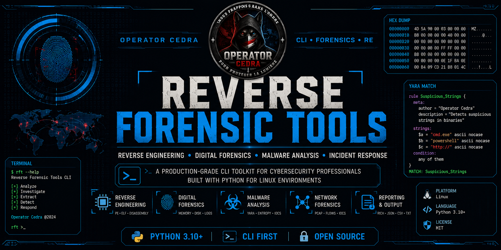

<p align="center">
  
</p>

<h1 align="center">Reverse Forensic Tools</h1>

<p align="center">
  <strong>Production-grade Reverse Engineering & Digital Forensics CLI Toolkit</strong>
</p>

<p align="center">


> 🚧 **Project Status:** Active Development
>
> This project is currently under active development. Features, APIs, and architecture may change before the first stable release.
</p>

---

# About

Reverse Forensic Tools is a modular command-line toolkit designed for reverse engineering, malware analysis, and digital forensic investigations.

Built primarily for DFIR analysts, SOC analysts, malware researchers, cybersecurity students, and CTF players, the toolkit focuses on providing fast, reliable, and production-ready forensic utilities in one unified framework.

Developed by **Operator Cedra**.

---

# Features

## Utilities

- File Hash Calculator
- File Type Identification
- Hex Dump Viewer
- Magic Bytes Detection

## Reverse Engineering

- PE Analysis
- ELF Analysis
- Import Table
- Export Table
- Section Viewer
- Binary Metadata
- Capstone Disassembler
- Ghidra Integration
- Radare2 Integration

## Malware Analysis

- YARA Scanner
- Entropy Analysis
- Strings Extraction
- IOC Detection

## Memory Forensics

- Volatility3 Wrapper
- Process Enumeration
- Memory Dump Analysis

## Disk Forensics

- MFT Parser
- Deleted File Recovery
- Timeline Generation

## Network Forensics

- PCAP Parser
- Flow Extraction
- Protocol Statistics
- IOC Detection

## Log Analysis

- Linux Syslog
- Windows Event Logs
- Authentication Logs
- Anomaly Detection

---

# Project Structure

```text
reverse-forensic-tools/
│
├── config/
│   ├── config.yaml
│   ├── rules/
│   └── templates/
│
├── data/
│   ├── output/
│   └── samples/
│
├── docs/
│   └── images/
│
├── results/
│
├── scripts/
│
├── src/
│   ├── core/
│   ├── forensic/
│   ├── reverse_engineering/
│   ├── utils/
│   └── tests/
│
├── requirements.txt
├── requirements-dev.txt
├── pyproject.toml
├── setup.py
├── Makefile
└── README.md
```

---

# Installation

Clone repository

```bash
git clone https://github.com/reactivheat/reverse-forensic-tools.git
```

Enter project

```bash
cd reverse-forensic-tools
```

Create virtual environment

```bash
python -m venv .venv
```

Activate environment

Linux

```bash
source .venv/bin/activate
```

Windows

```powershell
.venv\Scripts\activate
```

Install dependencies

```bash
pip install -r requirements.txt
```

---

# Usage

Hash a file

```bash
python -m src.core.cli hash malware.exe
```

Identify file type

```bash
python -m src.core.cli identify malware.exe
```

Generate Hex Dump

```bash
python -m src.core.cli hexdump malware.exe
```

---

# Current Progress

| Module | Status |
|----------|--------|
| Config Manager | ✅ |
| Logger | ✅ |
| CLI Core | ✅ |
| Hash Calculator | ✅ |
| File Identifier | ✅ |
| Hex Dump Viewer | ✅ |
| PE Parser | 🚧 |
| ELF Parser | 🚧 |
| Disassembler | ⏳ |
| Malware Analysis | ⏳ |
| Network Forensics | ⏳ |
| Memory Forensics | ⏳ |
| Disk Forensics | ⏳ |
| Log Analysis | ⏳ |

---

# Dependencies

- Python 3.10+
- Rich
- Capstone
- Pefile
- PyELFTools
- YARA Python
- Volatility3
- Scapy
- DFIR-NTFS
- Python Magic
- PyYAML

---

# Roadmap

- [x] Core CLI
- [x] Configuration Manager
- [x] Logger
- [x] Hash Calculator
- [x] File Identifier
- [x] Hex Dump Viewer
- [ ] PE Parser
- [ ] ELF Parser
- [ ] Capstone Disassembler
- [ ] Malware Analysis
- [ ] Network Forensics
- [ ] Memory Forensics
- [ ] Disk Forensics
- [ ] Timeline Generator
- [ ] Report Generator
- [ ] Interactive Rich Dashboard

---

# Contributing

Contributions are welcome.

Please open an Issue first to discuss major changes before submitting a Pull Request.

---

# License

This project is licensed under the MIT License.

---

# Author

## Operator Cedra

Digital Forensics • Reverse Engineering • Malware Analysis • SOC Analyst

GitHub

https://github.com/reactivheat

---

<p align="center">

**"Nous frappons dans l'ombre pour protéger la lumière."**

</p>
